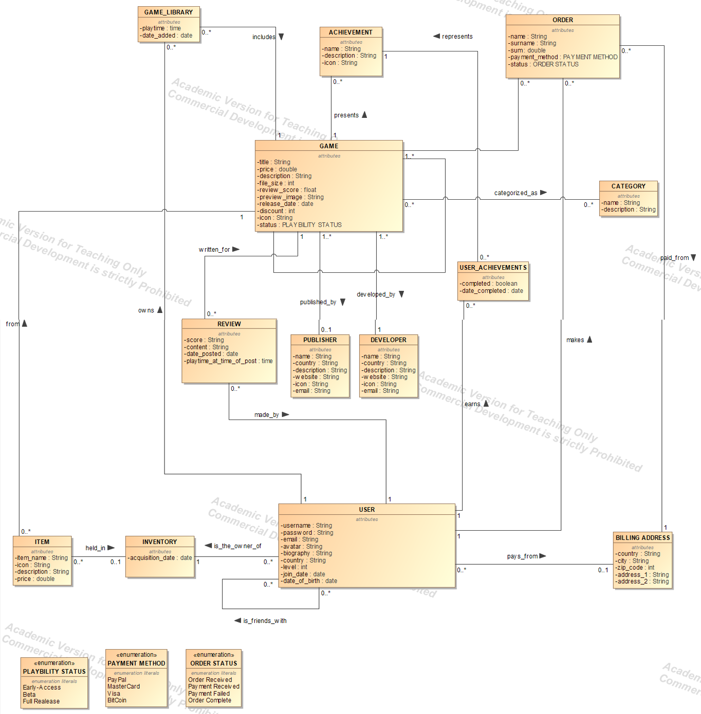

# Website with DB using Flask and SQL
### Description:
A mini website to display data of an sql database that stores info of a mock digital game retailer (like Steam)using python and flask (+ jinja). Made for trying out Flask and SQL. The database was created using Dassault Magic Systems of Systems Architect.

### Schema of database:

### How to use:
- Install XAMPP or any similar program.
- Start the Apache and MySQL modules.
- Import the database from the sql dump.
- Enter .env variables
- Run the program.

### Details
- A generic method for displaying is used, instead of each table having its own.
    - Though this proved to be a very unnecessary and cumbersome task which has a high propability of falling apart if the database grows larger.
- The website is created with pure html and css (and ofcourse jinja) which I found out was a stupid decision after learning about frameworks like Bootstrap which will be implemented in the future.

### TODO:
- Make unique methods for CRUD operations.
    - Edit and create operations should include a drop down table that shows multiple choices from a table linked with foreign keys.